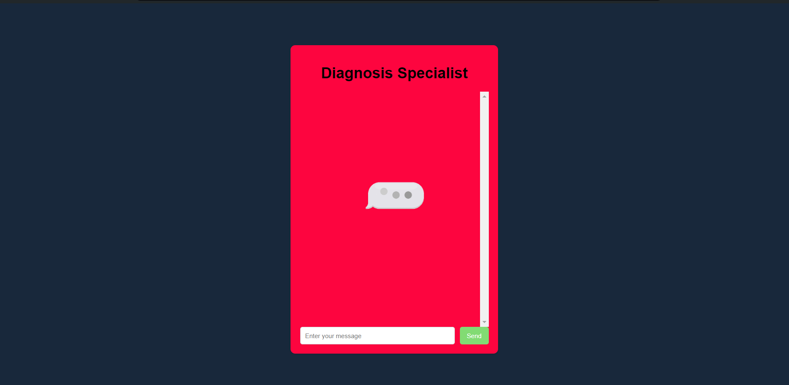
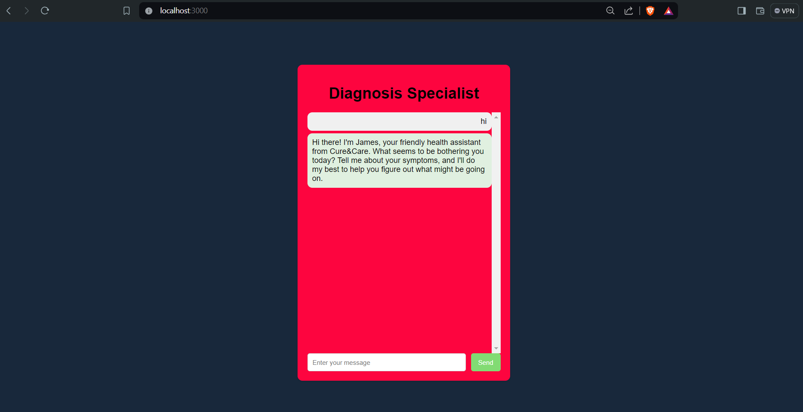
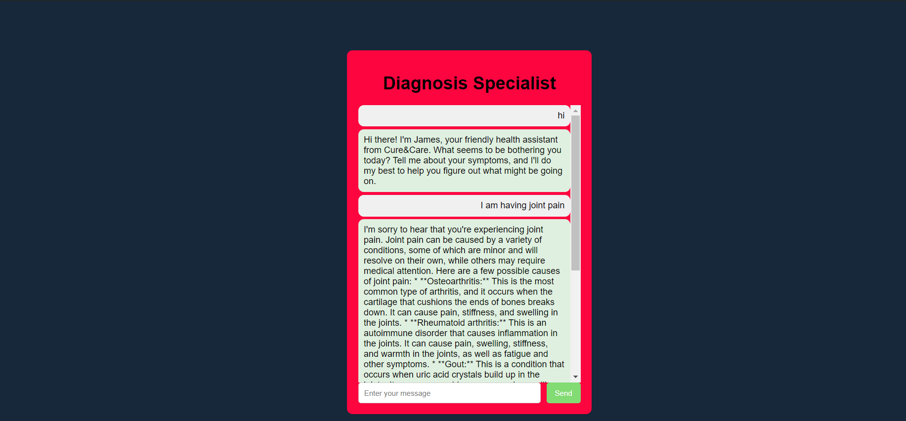
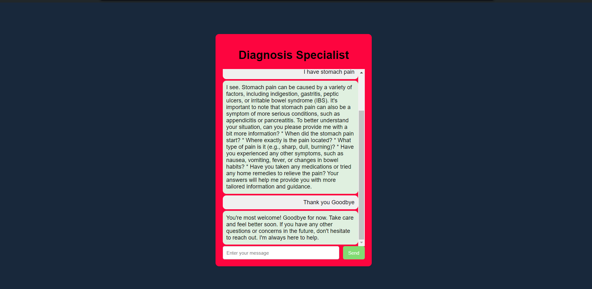

# Diagnosis Specialist

## How to run the chatbot
1. install npm
2. create .env file and add your API key as: API_KEY="Your API Key"
3. run server.js

## Features
1. Interactive user interface
2. User will give the symptoms of their diseases as input and chatbot will predict the disease based on given symptoms 
   and it suggest a treatment plan for the disease.
3. Easy to use and compatible in any device.
4. Will predict the disease only on the basis of given dataset and does not use the internet.
5. Good integration of LLM with project.

## Known Issues
1. Not able to identify a unique disease for all sort of symptoms and in that case it will give a list of diseases and their corresponding treatment.
2. Since it only takes data from the given dataset, it will not identify diseases that are not in the dataset.
3. Chatbot might break, if the user responds to bot about things other than symptoms. 
4. When the user write their symptoms, it may take some time before the bot gives their answer due to large no. of tokens. 

## Future Updates
1. In future, user can input images of their diseases and chatbot will predict a disease from the image and suggest a treatment.
2. Better UI/UX of website.
3. Will be more hardcoded, and less prone to jailbreak.

## Screenshots

